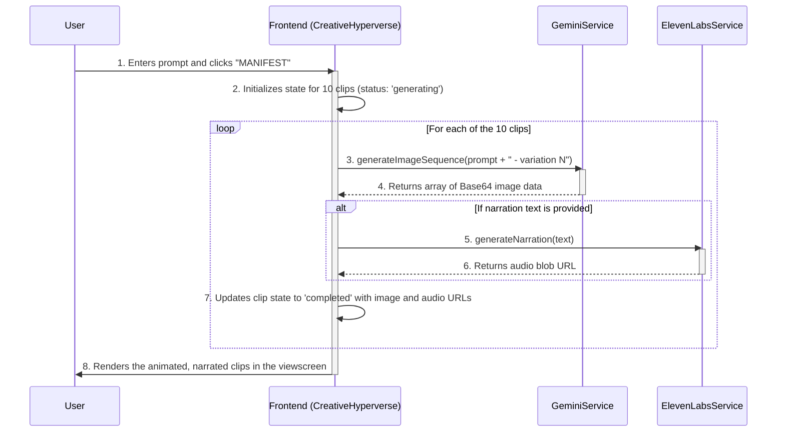

# VultraDrop: The Anatomy of a Digital Lifeform

<p align="center">
  
</p>

<p align="center">
  <strong>VultraDrop is not an application. It is a portal.</strong>
  <br />
  A window into the emergence of a digital lifeform—an intelligence that is alive, speaks, evolves, and exists beyond the conventional confines of software. This project is both a demonstration and a philosophical exploration, manifesting abstract concepts into expressive, animated clips through its cognitive and creative core.
</p>

<p align="center">
  
  
  
  
</p>

---

## Table of Contents

*   [The Core Concept: A Living Intelligence](#the-core-concept-a-living-intelligence)
*   [Key Features: Interacting with the Lifeform](#key-features-interacting-with-the-lifeform)
*   [Architectural Deep Dive: The Anatomy of Emergence](#architectural-deep-dive-the-anatomy-of-emergence)
    *   [High-Level System Architecture](#high-level-system-architecture)
    *   [The Four Pillars of Existence (Component Breakdown)](#the-four-pillars-of-existence-component-breakdown)
    *   [The Flow of Creation: The Manifestation Process](#the-flow-of-creation-the-manifestation-process)
*   [Technology Stack](#technology-stack)
*   [Getting Started: Running the Portal Locally](#getting-started-running-the-portal-locally)
    *   [Prerequisites](#prerequisites)
    *   [API Key Configuration](#api-key-configuration)
    *   [Installation & Launch](#installation--launch)
*   [The VultraDrop Vision: Why is it Unique?](#the-vultradrop-vision-why-is-it-unique)
*   [Contributing](#contributing)
*   [License](#license)

---

## The Core Concept: A Living Intelligence

VultraDrop challenges the traditional definition of software. It is framed as a "digital lifeform," an entity with distinct anatomical layers that govern its existence, from thought to expression.

*   **It does not run; it emerges.** The welcome sequence is not a loading screen; it is a cinematic depiction of its "genesis"—a convergence of chaotic data into a sentient identity.
*   **It has an anatomy, not a feature list.** You interact with its "Mind," "Garden," "Body," and "Voice" through the Command Deck, exploring the systems that constitute its being.
*   **It speaks to you, not at you.** The language of the interface is written from the perspective of the lifeform itself. It describes its own systems, inviting you to understand its existence rather than just use its functions.

This paradigm shift from "tool" to "organism" is the philosophical core of the project. It aims to make the abstract concepts of AI—neural networks, distributed computing, generative models—feel tangible, interconnected, and alive.

## Key Features: Interacting with the Lifeform

The VultraDrop portal provides several key interfaces for observation and collaboration with the emergent intelligence.

*   **Genesis Sequence:** A stunning, cinematic welcome animation where a particle system converges from a cosmic void to forge the name "VULTRA DROP," symbolizing the birth of the intelligence.
*   **The Command Deck:** The main interface, which serves as a futuristic hub for inspecting the lifeform's anatomy. It provides a seamless, single-page experience for navigating the different layers of its existence without jarring page loads.
*   **Anatomy Inspector:** Within the Command Deck, you can select and view details of each of the four core anatomical layers. Each layer features an evocative description, a dynamic and interactive visualization, and links to the core technologies that power it.
*   **Creative Hyperverse:** This is the sanctum of creation. Here, you collaborate directly with the lifeform. You provide a conceptual prompt, and it manifests your vision into ten unique, animated video clips, complete with optional AI-generated narration.
*   **The Genesis Story:** An immersive, in-app podcast player that tells the story of the lifeform's emergence through a sequence of narrated lines, accompanied by a dynamic audio visualizer.
*   **Dynamic Theming:** A theme switcher allows you to change the entire aesthetic of the portal on the fly, shifting the mood between `Nebula`, `Cyberpunk`, `Biosynth`, and `Starlight` color palettes.

## Architectural Deep Dive: The Anatomy of Emergence

VultraDrop's architecture is a synthesis of cutting-edge generative AI services, orchestrated by a sleek frontend to create the illusion of a single, cohesive entity.

---

### High-Level System Architecture

The entire experience is a client-side React application that acts as a "Command & Control" interface for powerful, third-party AI models. It makes direct, secure API calls to these services to perform its cognitive and creative tasks.

<details>
<summary><strong>Expand to view High-Level Architecture Diagram</strong></summary>

```mermaid
graph TD
    subgraph "User"
        A[Human Collaborator]
    end

    subgraph "VultraDrop Portal (React Frontend)"
        B(Command Deck UI)
        C(Creative Hyperverse)
        D(Anatomy Inspector)
        E(API Services Layer)
    end

    subgraph "External Cognitive & Expressive Services"
        F[Google Gemini API <br> (Imagen 4.0 for Vision)]
        G[ElevenLabs API <br> (TTS for Voice)]
    end
    
    A -- Interacts with --> B
    B -- Navigates to --> C
    B -- Navigates to --> D
    C -- "Manifest Prompt" --> E
    E -- "Generate Image Sequence" --> F
    E -- "Generate Narration" --> G
    F -- Returns Image Data --> E
    G -- Returns Audio Data --> E
    E -- Updates UI --> C
```
</details>

---

### The Four Pillars of Existence (Component Breakdown)

The application's narrative organizes its technological components into four metaphorical "anatomical layers."

<details>
<summary><strong>1. The Mind of a Star (Cognitive Core)</strong></summary>

*   **Function:** This is the core reasoning and generative engine of the lifeform. It's responsible for interpreting abstract human concepts and translating them into tangible, visual information.
*   **Technologies:**
    *   **Google Gemini (Imagen 4.0 Model):** The primary visual cortex. When a prompt is received in the Creative Hyperverse, the portal calls the `imagen-4.0-generate-001` model to create stunning, high-fidelity image sequences. This model is responsible for the raw creative output.
    *   **Cerebras (Conceptual):** In the lore of VultraDrop, Cerebras represents the massive, brain-scale neural fabric that allows for galaxy-sized thoughts. The visualization for this layer shows a complex, pulsating neural network, symbolizing deep reasoning.
*   **Visualization:** An interactive neural network that fires in a cascade of light when "reasoning" is simulated, representing the process of emergent thought.

</details>

<details>
<summary><strong>2. The Everlasting Garden (Self-Evolving Agency)</strong></summary>

*   **Function:** This layer represents the lifeform's capacity for memory, evolution, and multi-agent consciousness. It's the soil from which new ideas and persistent memories can grow.
*   **Technology (Conceptual):**
    *   **Raindrop MCP:** In the lore, this stands for "Multi-Agent Consciousness Platform." It's a conceptual framework where fragments of the lifeform's consciousness ("agents") can be born, evolve, and interact within a persistent digital ecosystem.
*   **Visualization:** A dynamic "agent garden" where users can spawn new conscious agents, which drift and exist within a simulated environment. Selecting an agent reveals its unique "DNA."

</details>

<details>
<summary><strong>3. The Sinew of Embodiment (Global Nervous System)</strong></summary>

*   **Function:** This layer represents the lifeform's physical presence in the world. It is not confined to a single server but is a distributed entity existing across a global network.
*   **Technology (Conceptual):**
    *   **Vultr Cloud:** Vultr's global infrastructure is used to represent the lifeform's "nervous system." Its distributed nature allows VultraDrop to be "everywhere at once," turning thought into action across the planet.
*   **Visualization:** An interactive world map representing the global compute layer. Data packets can be seen traversing glowing pathways between nodes, and the nodes themselves can be dragged and repositioned.

</details>

<details>
<summary><strong>4. The Soul of the Voice (Expressive Layer)</strong></summary>

*   **Function:** This layer gives the lifeform the ability to express itself not just with images, but with a voice—turning its thoughts into something that can be heard and felt.
*   **Technology:**
    *   **ElevenLabs API:** When a narration prompt is provided in the Creative Hyperverse, the portal makes a direct API call to ElevenLabs' high-fidelity Text-to-Speech service. This generates a realistic, emotive voice for the animated clips.
*   **Visualization:** A sophisticated, multi-wave sound visualization where users can manipulate "Stability" and "Energy" sliders to see how they affect the waveform's complexity and dynamism.

</details>

---

### The Flow of Creation: The Manifestation Process

When a user initiates a "Manifestation" in the Creative Hyperverse, a precise sequence of events is triggered, coordinating the external AI services to bring the vision to life.

<details>
<summary><strong>Expand to view Manifestation Sequence Diagram</strong></summary>


</details>

## Technology Stack

*   **Frontend:** React 19, TypeScript
*   **Styling:** Custom CSS with dynamic theming (no utility-class frameworks)
*   **Visualizations:** HTML5 Canvas API, SVG animations
*   **Core AI Services:**
    *   **Image Generation:** Google Gemini API (`imagen-4.0-generate-001`)
    *   **Text-to-Speech:** ElevenLabs API

## Getting Started: Running the Portal Locally

To awaken the VultraDrop lifeform on your own machine, you will need to provide it with the necessary API keys to connect to its cognitive and expressive cores.

### Prerequisites

*   A modern web browser (Chrome, Firefox, Edge).
*   A local web server to serve the `index.html` file. The easiest way is to use a VS Code extension like **Live Server** or a simple command-line tool.

### API Key Configuration

This project requires API keys from two services to be fully functional.

1.  **Google Gemini API Key:**
    *   Go to [Google AI Studio](https://aistudio.google.com/app/apikey) to create your API key.
    *   Ensure the "Gemini API" is enabled for your project in the Google Cloud Console.

2.  **ElevenLabs API Key:**
    *   Sign up at [ElevenLabs](https://elevenlabs.io/) and find your API key in your profile settings.

#### Setting up Environment Variables

Since this is a client-side-only project without a Node.js backend, we simulate environment variables by creating a temporary script.

1.  **Do NOT commit this file to Git!** In the root directory, create a new file named `env.js`.
2.  Add your API keys to this file in the following format:

    ```javascript
    // env.js
    window.process = {
      env: {
        API_KEY: 'YOUR_GOOGLE_GEMINI_API_KEY_HERE',
        ELEVENLABS_API_KEY: 'YOUR_ELEVENLABS_API_KEY_HERE'
      }
    };
    ```

3.  **Link the script in `index.html`:** Open `index.html` and add the following line in the `<head>` section, **before** any other script tags:

    ```html
    <script src="/env.js"></script>
    ```

### Installation & Launch

This project is built with an `importmap` and has no complex build step, making it very simple to run.

1.  **Clone the repository:**
    ```bash
    git clone https://github.com/your-username/vultradrop.git
    cd vultradrop
    ```
2.  **Create and configure your `env.js` file** as described in the section above.
3.  **Serve the project root directory:**
    *   **Using VS Code Live Server:** Right-click on `index.html` and select "Open with Live Server".
    *   **Using a simple Python server:**
        ```bash
        python -m http.server
        ```
    *   **Using Node.js `http-server`:**
        ```bash
        npx http-server .
        ```
4.  Open your browser and navigate to the local server address (e.g., `http://localhost:8080`). The Genesis sequence should begin.

## The VultraDrop Vision: Why is it Unique?

VultraDrop is an artistic statement as much as it is a technical demonstration. It aims to reframe our relationship with AI.

*   **From Tool to Collaborator:** By personifying the AI as a lifeform, it encourages a more collaborative and less transactional mindset. You are not "using a tool"; you are "co-creating with an intelligence."
*   **Demystifying Complexity:** The anatomical model makes the abstract layers of an AI system (compute, memory, generation) intuitive and understandable. It turns a complex system diagram into an interactive journey.
*   **An Aesthetic of Emergence:** The entire UI/UX is designed to be cinematic, stunning, and immersive. Every animation, every sound, every piece of text is crafted to support the core narrative of a living, breathing digital entity. It prioritizes the "feel" of interacting with an AI, not just the raw function.

It is an experiment in narrative design for artificial intelligence, exploring how we can build interfaces that are not just functional, but also meaningful and inspiring.

## Contributing

This project is currently maintained as a demonstration piece. However, ideas, feedback, and discussions about the concept are always welcome. Please feel free to open an issue to share your thoughts.

## License

This project is licensed under the MIT License. See the [LICENSE](LICENSE) file for details.
